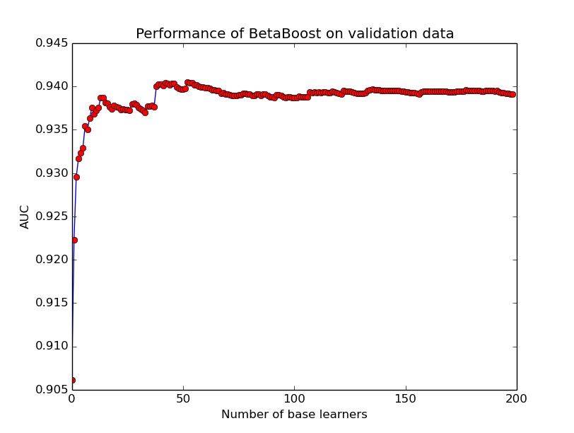

[](http://quantlet.de/)

## [](http://quantlet.de/) **BetaBoost** [](http://quantlet.de/)

```yaml

Name of QuantLet : BetaBoost

Published in : 'Zieba, Maciej, and Wolfgang K. Härdle. "Beta-boosted ensemble for big credit scoring data." (2016).'

Description : 'Procedure of constructing BetaBoost model for credit scoring problem. Two types of base models can be selected for the model. The quality of the model is evaluated by artificial dataset. The dataset was artificially created using separate multivariate gaussian distributions for each of the classes. The parameters for the distributions were estimated using Kaggle GMSC dataset.'

Keywords : 'beta boost, ensemble classifier, beta binomial distribution, AdaCost, AdaBoost, credit scoring'

Author : Maciej Zieba

Submitted : 7, Dec, 2016

Datafile : 'data.csv'

Example :
- Case study of artificial data
```




### PYTHON Code
```python

import csv
import numpy as np
import time
from sklearn import linear_model
from sklearn import tree
from sklearn import metrics
import matplotlib.pyplot as plt

# Sample artificial dataset used for testing
dataset_name = 'data.csv'
class_attribute ='class'

other_attributes = ['X1','X2','X3',	'X4','X5','X6','X7','X8','X9','X10']

#Special value for missing cases
missing_val = -1;


num_of_attributes = len(other_attributes)
other_attributes.append(class_attribute)

# Checking the number of rows
with open(dataset_name) as csvfile:
    reader = csv.DictReader(csvfile)
    row_count = sum(1 for row in reader)

#Intialzation of training data
data = np.zeros((row_count,num_of_attributes + 1));

#Readnig the dataset
for i in range(0,len(other_attributes)):
    j = 0;
    with open(dataset_name) as csvfile:
        reader = csv.DictReader(csvfile)
        for row in reader:
            if(row[other_attributes[i]]=='?' or row[other_attributes[i]]==''):
                data[j,i] = missing_val;
            else:
                data[j,i] = row[other_attributes[i]]
            j = j + 1;

# Number of folds to be processed
n_folds = 5;

#Number of folds to be run
n_folds_run = 1;

# Random splitter to separate training and testing data
r = np.random.randint(n_folds, size=(data.shape[0], ))

# Structure that collects AUC values for testing data for each fold
auc_sp = [];

# Base model is either LR or Tree
base_model = 'Tree'
# Number of base learners cosidered in the exepriments
self_rounds =200;

#Parameters for Beta binomial distribution (index 1 for class 1 (assumed to be positive) 0 for class 0)
a_1 = 0.8;
b_1 = 1.5;
a_0 = 1.5;
b_0 = 0.8;

# Structures store data for plots (for last of the executed folds)
auc_train_beta = np.zeros((self_rounds-1,));
auc_val_beta = np.zeros((self_rounds-1,));

start_time = time.time()

for k in range(0,n_folds_run):#n_folds):
    print('Total number of folds:' + str(n_folds_run) )
    print('Currently running fold: '+ str(k + 1))
    #Creating testing and training and testing data
    dataTest = data[r==k,:];
    dataTrain = data[r!=k,:];

    # Separate 10% of data for validation
    r_val = np.random.randint(10, size=(dataTrain.shape[0], ))
    dataVal = dataTrain[r_val==0,:];
    dataTrain = dataTrain[r_val!=0,:];

    # This structure is going to store the predictions of single base learners
    preds = np.zeros((dataTest.shape[0],self_rounds));
    preds_val = np.zeros((dataVal.shape[0],self_rounds));
    preds_train = np.zeros((dataTrain.shape[0],self_rounds));
    auc_best = 0;
    n_best = -1;

    for n in range(0,self_rounds):
        if(n == 0):
            if(base_model=='LR'):
                lr = linear_model.LogisticRegression(C=1e5)
            else:
                lr = tree.DecisionTreeClassifier(max_depth=7, min_samples_leaf=10)
            lr.fit(dataTrain[:,0:num_of_attributes],dataTrain[:,num_of_attributes])
            pred = lr.predict_proba(dataTest[:,0:num_of_attributes])
            pred = pred[:,1]
            preds[:,n] = pred;
            pred = lr.predict_proba(dataVal[:,0:num_of_attributes])
            pred = pred[:,1]
            preds_val[:,n] = pred;
            pred_train = lr.predict_proba(dataTrain[:,0:num_of_attributes])
            pred_train = pred_train[:,1]
            preds_train[:,n] =  pred_train
        else:

            pred = np.mean(preds_train[:,0:n],axis=1)
            ind = np.argsort(pred);
            dataTrain_temp = dataTrain[ind,:]
            dataTrain_1 = dataTrain_temp[dataTrain_temp[:,num_of_attributes]==1,:]
            dataTrain_0 = dataTrain_temp[dataTrain_temp[:,num_of_attributes]==0,:]
            N1 = dataTrain_1.shape[0]
            N0 = dataTrain_0.shape[0]
            N_sample = int((N1+N0)/2)
            def generateSamples(N_data,N_out,a,b):
                p = np.random.beta(a,b,(N_out,))
                y = np.zeros((N_out,),dtype=int)
                for i in range(0,N_out):
                    y[i] = np.random.binomial(N_data,p[i],size=(1,))[0]
                return y
            ind_1 = generateSamples(N1-1,N_sample,a_1,b_1);
            ind_0 = generateSamples(N0-1,N_sample,a_0,b_0);
            dataTrain_1 = dataTrain_1[ind_1,:];
            dataTrain_0 = dataTrain_0[ind_0,:];
            dataTrain_temp = np.concatenate((dataTrain_1,dataTrain_0),axis=0)
            if(base_model=='LR'):
                lr = linear_model.LogisticRegression(C=1e5)
            else:
                lr = tree.DecisionTreeClassifier(max_depth=7, min_samples_leaf=10)
            lr.fit(X=dataTrain_temp[:,0:num_of_attributes],y=dataTrain_temp[:,num_of_attributes])
            pred = lr.predict_proba(dataTest[:,0:num_of_attributes])
            pred = pred[:,1]
            preds[:,n] = pred;
            pred = lr.predict_proba(dataVal[:,0:num_of_attributes])
            pred = pred[:,1]
            preds_val[:,n] = pred;
            pred = np.mean(preds_val,axis=1)
            auc_val = metrics.roc_auc_score(dataVal[:,num_of_attributes],pred)
            auc_val_beta[n-1] = auc_val
            if(auc_val>auc_best):
                auc_best = auc_val;
                n_best = n;
                print("The best auc on val set: " + str(auc_best))
                print("Iteration: " + str(n_best))

            pred_train = lr.predict_proba(dataTrain[:,0:num_of_attributes])
            pred_train = pred_train[:,1]
            preds_train[:,n] =  pred_train

            pred = np.mean(preds_train, axis=1)
            auc_train = metrics.roc_auc_score(dataTrain[:, num_of_attributes], pred)
            auc_train_beta[n - 1] = auc_train

    pred = np.mean(preds[:,0:n_best],axis=1)
    auc_best = metrics.roc_auc_score(dataTest[:,num_of_attributes],pred);
    auc_sp.append(auc_best)
end_time = time.time()
print("")
print("Execution time (in sec.): " + str(end_time - start_time))
print("")
print("Final results on validation data:")
print("Mean: "+str(np.mean(auc_sp)))
print("Std: "+str(np.std(auc_sp)))
print("")
print("Details for each fold")
print(auc_sp)

t1 = np.arange(0, self_rounds-1)

plt.plot(t1, auc_train_beta , 'b-',t1, auc_train_beta , 'ro')
plt.ylabel('AUC')
plt.xlabel('Number of base learners')
plt.title('Performance of BetaBoost on training data')
plt.show()

plt.plot(t1, auc_val_beta , 'b-',t1, auc_val_beta , 'ro')
plt.ylabel('AUC')
plt.xlabel('Number of base learners')
plt.title('Performance of BetaBoost on validation data')
plt.show()
```

automatically created on 2018-10-15